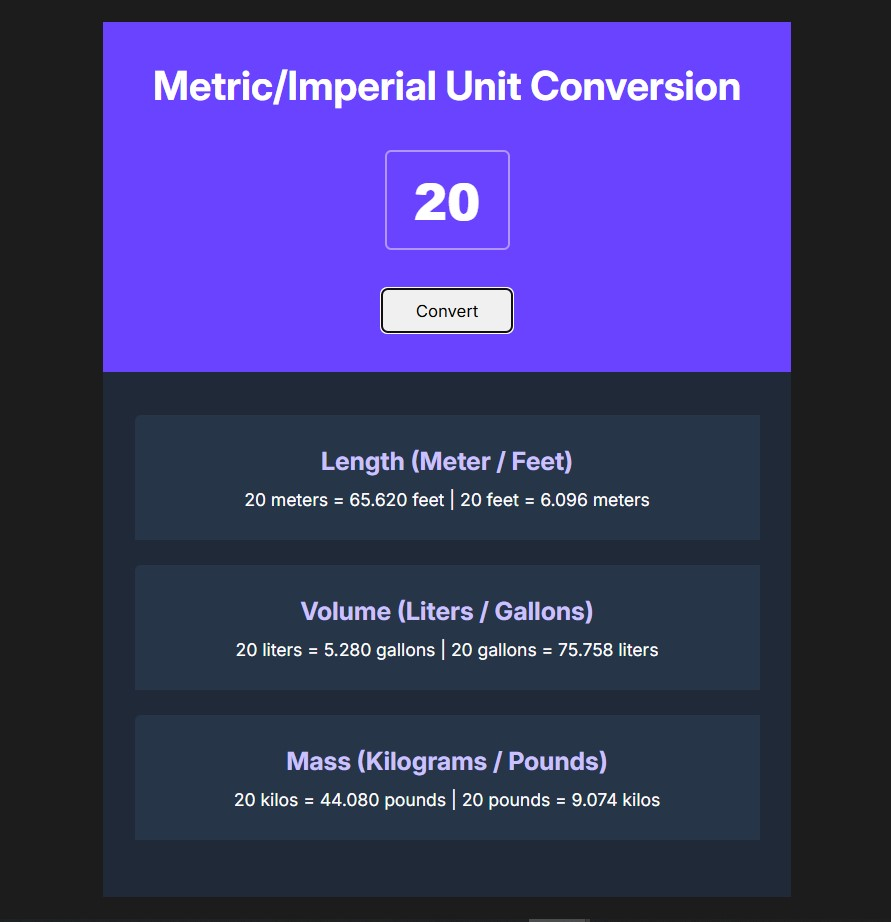

# Unit Converter

A simple metric/imperial unit converter built as a solo project.  
This project allows users to convert between meters and feet, liters and gallons, and kilograms and pounds.

## Screenshot

## Features

- Convert length (meters ↔ feet)
- Convert volume (liters ↔ gallons)
- Convert mass (kilograms ↔ pounds)
- Built with vanilla HTML, CSS, and JavaScript

## Usage

1. Enter a number in the input field.
2. Click the **Convert** button.
3. View the converted values for all three unit types.

## Project Structure

- `index.html` – Main HTML file
- `index.css` – Styles for the app
- `index.js` – Conversion logic and DOM manipulation
- `README.md` – Project documentation

## Getting Started

1. Clone or download this repository.
2. Open `index.html` in your browser.

---

**Author:** Ahmad